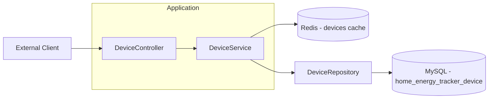
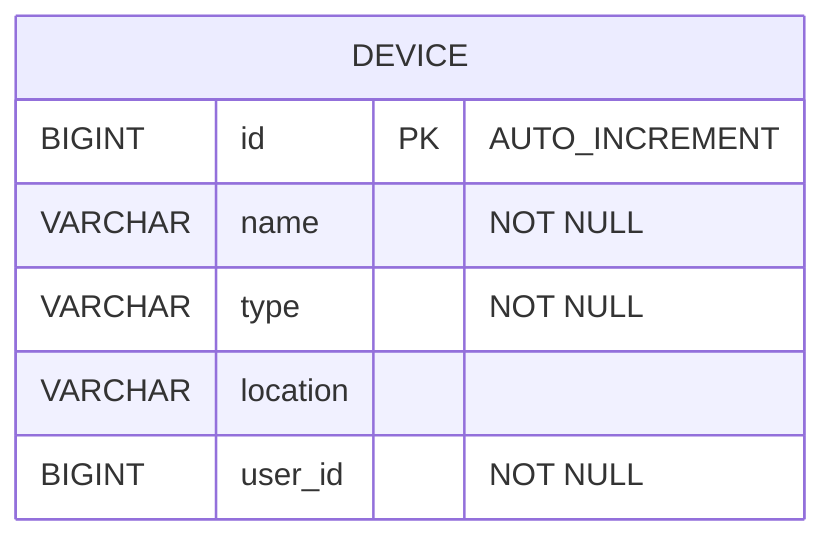
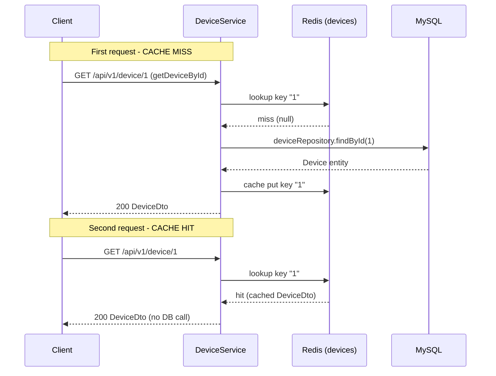

# 🛠️ Device Service

  

> Java Spring Boot microservice that manages the devices of the **Energy Tracker** home energy tracking platform.

The **Device Service** provides a REST API to Create, Read, Update and Delete devices, along with dynamic filtering, pagination and a way to list every device belonging to a user. It is designed as a self-contained, testable microservice: it uses JPA/Hibernate with MySQL for persistence, Redis as a caching layer to speed up read operations, and Flyway to version the database schema.

---

## 📑 Table of Contents

- [Architecture](#-architecture)
- [Tech Stack](#-tech-stack)
- [API Endpoints](#-api-endpoints)
- [Request / Response Examples](#-request--response-examples)
- [Data Model](#-data-model)
- [Getting Started](#-getting-started)
- [Configuration](#-configuration)
- [Testing](#-testing)
- [Caching Strategy](#-caching-strategy)
- [Error Handling](#-error-handling)
- [Project Structure](#-project-structure)
- [Roadmap](#-roadmap)

---

## 🏗️ Architecture

The service follows a classic **layered architecture**: `Controller → Service → Repository → Database`. DTOs are used as the API contract, entities for persistence, and Specifications for dynamic filtering. The Service layer reads from a Redis cache (via Spring Cache) before hitting the database.



Cache interactions between the Service and Redis use Spring Cache — `@Cacheable` / `@CacheEvict` on the `devices` cache.

---

## 🧰 Tech Stack

| Technology          | Version    | Purpose                                   |
| ------------------- | ---------- | ----------------------------------------- |
| Java                | 21         | Language / runtime                        |
| Spring Boot         | 4.1.1      | Application framework                     |
| Spring WebMVC       | (SB)       | REST controllers                          |
| Spring Data JPA     | (SB)       | Persistence / repositories                |
| Hibernate           | (SB)       | ORM implementation                        |
| AspectJ (Spring AOP)| (SB)       | Aspect-oriented logging / timing          |
| MySQL               | 8          | Production database                       |
| H2                  | (SB)       | Embedded DB for JPA slice tests           |
| Redis               | —          | Cache layer (`devices` cache)             |
| Flyway              | (SB)       | Database migrations                       |
| SpringDoc OpenAPI   | 3.1.1      | Swagger UI / API documentation            |
| Lombok              | 1.18.36    | Boilerplate reduction                     |
| Maven               | —          | Build tool                                |
| Docker              | —          | Local infra via `docker-compose`          |
| Testcontainers      | 1.21.3     | Real MySQL + Redis in E2E tests           |
| JUnit 5 / Mockito / AssertJ | —  | Testing                                   |

---

## 🔗 API Endpoints

All endpoints are under the base path `/api/v1/device`.

> Interactive docs available at [Swagger UI](http://localhost:8081/swagger-ui.html) (OpenAPI spec at [`/v3/api-docs`](http://localhost:8081/v3/api-docs), group `devices`).

| Method | Path             | Description                                     | Status codes             |
| ------ | ---------------- | ----------------------------------------------- | ------------------------ |
| POST   | `/`              | Create a device                                 | `201`, `400`, `500`      |
| GET    | `/`              | List all devices (paginated)                    | `200`, `400`, `500`      |
| GET    | `/search`        | Search devices with optional filters + pagination | `200`, `400`, `500`      |
| GET    | `/{id}`          | Get a device by id (cacheable)                  | `200`, `404`, `500`      |
| GET    | `/user/{userId}` | List devices belonging to a user (paginated)    | `200`, `400`, `500`      |
| PUT    | `/{id}`          | Update an existing device                       | `200`, `400`, `404`, `500` |
| DELETE | `/{id}`          | Delete a device by id                           | `204`, `404`, `500`      |

`GET /search` accepts the following optional query params: `name`, `location` (case-insensitive fragments), `type` (a `DeviceType` enum value), `userId` (exact match), plus pagination `page` (default `0`) and `size` (default `10`).

---

## 📦 Request / Response Examples

### Create a device

```http
POST /api/v1/device
Content-Type: application/json
```

```json
{
  "name": "Smart Bulb Salón",
  "type": "LIGHT",
  "location": "Salón principal",
  "userId": 1
}
```

**Response `201 Created`** — the `id` is auto-generated:

```json
{
  "id": 1,
  "name": "Smart Bulb Salón",
  "type": "LIGHT",
  "location": "Salón principal",
  "userId": 1
}
```
**Response `400 Bad Request`** (validation failed):

```json
{
  "status": 400,
  "error": "Bad Request",
  "message": "name: must not be blank, userId: must not be null"
}
```

### Get a device by id

```http
GET /api/v1/device/1
```

**Response `200 OK`**

```json
{
  "id": 1,
  "name": "Smart Bulb Salón",
  "type": "LIGHT",
  "location": "Salón principal",
  "userId": 1
}
```

**Response `404 Not Found`**

```json
{
  "status": 404,
  "error": "Not Found",
  "message": "Device not found with id: 99"
}
```

### Update a device

```http
PUT /api/v1/device/1
Content-Type: application/json
```

```json
{
  "name": "Smart Bulb Cocina",
  "type": "LIGHT",
  "location": "Cocina",
  "userId": 1
}
```

**Response `200 OK`**

```json
{
  "id": 1,
  "name": "Smart Bulb Cocina",
  "type": "LIGHT",
  "location": "Cocina",
  "userId": 1
}
```

### Delete a device

```http
DELETE /api/v1/device/1
```

**Response `204 No Content`** (empty body).

---

### List all devices (paginated)

```http
GET /api/v1/device?page=0&size=10
```

**Response `200 OK`** — the `PageResponse` wrapper:

```json
{
  "content": [
    {
      "id": 1,
      "name": "Smart Bulb Salón",
      "type": "LIGHT",
      "location": "Salón principal",
      "userId": 1
    }
  ],
  "page": 0,
  "size": 10,
  "totalElements": 1,
  "totalPages": 1,
  "last": true,
  "first": true,
  "empty": false
}
```

### List devices by user (paginated)

```http
GET /api/v1/device/user/1?page=0&size=10
```

**Response `200 OK`** — a `PageResponse` with only the devices owned by user `1`.

### Search devices (paginated, filtered)

```http
GET /api/v1/device/search?name=bombilla&type=LIGHT&userId=1&page=0&size=10
```

**Response `200 OK`** — a `PageResponse` of the matching devices.

---

## 🗂️ Data Model

The persistence model is intentionally simple: a single `Device` entity mapped to the `device` table. Each device belongs to a user referenced by `user_id` (no FK, for simplicity of the microservice boundary — ownership is validated from the client side).



| Field      | Type         | Constraints   | Notes                                        |
| ---------- | ------------ | ------------- | -------------------------------------------- |
| `id`       | Long         | PK, auto-generated | `IDENTITY` strategy                     |
| `name`     | String       | NOT NULL      | Max length 100 in entity                     |
| `type`     | DeviceType   | NOT NULL      | Stored as `VARCHAR` (enum `STRING`)          |
| `location` | String       | —             | Nullable in the DB schema                    |
| `user_id`  | Long         | NOT NULL      | Owner user id, indexed by `idx_device_user_id` |

`DeviceType` is an enum with the following values: `SPEAKER`, `CAMERA`, `THERMOSTAT`, `LIGHT`, `LOCK`, `DOORBELL`.

The schema is created and versioned by the Flyway migration `V1__device_table.sql`; `spring.jpa.hibernate.ddl-auto` is set to `none`.

---

## 🚀 Getting Started

### Prerequisites

- **Java 21** (JDK)
- **Maven** 3.9+
- **Docker** (with Docker Compose) for MySQL and Redis

### Running locally

1. Start the infrastructure (MySQL + Redis) with Docker Compose from the project root:

   ```bash
   docker compose up -d
   ```

2. The device service connects to its own database `home_energy_tracker_device`, so create it first (connect to MySQL and run):

   ```sql
   CREATE DATABASE IF NOT EXISTS home_energy_tracker_device;
   ```

   > Flyway will create and version the schema tables automatically on startup.

3. Run the application:

   ```bash
   mvn spring-boot:run
   ```

4. The service will be available at `http://localhost:8081` and Swagger UI at `http://localhost:8081/swagger-ui.html`.

---

## ⚙️ Configuration

Configuration lives in `src/main/resources/application.properties`. Sensitive and environment-specific values can be overridden via environment variables.

| Property / Env var                         | Default value                                             | Description                     |
| ------------------------------------------ | --------------------------------------------------------- | ------------------------------- |
| `SPRING_APPLICATION_NAME` / `spring.application.name` | `device-service`                          | Application name                |
| `SERVER_PORT` / `server.port`              | `8081`                                                    | HTTP port of the service        |
| `SPRING_DATASOURCE_URL`                    | `jdbc:mysql://localhost:3306/home_energy_tracker_device`  | MySQL JDBC URL                  |
| `SPRING_DATASOURCE_USERNAME`               | `root`                                                    | Database user                   |
| `SPRING_DATASOURCE_PASSWORD`               | `admin`                                                   | Database password               |
| `SPRING_DATA_REDIS_HOST`                   | `localhost`                                               | Redis host                      |
| `SPRING_DATA_REDIS_PORT`                   | `6379`                                                    | Redis port                      |
| `SPRINGDOC_SWAGGER_UI_PATH`                | `/swagger-ui.html`                                        | Swagger UI path                 |
| `SPRINGDOC_API_DOCS_PATH`                  | `/v3/api-docs`                                            | OpenAPI spec path               |
| `logging.level.org.springframework.cache`  | `TRACE`                                                   | Cache logging level (dev)       |

The application runs with the `default` (dev) profile.

---

## 🧪 Testing

The project follows a layered testing strategy mirroring the user microservice: fast unit tests, Spring slice tests (web / JPA / cache), and a full E2E test with real MySQL and Redis via Testcontainers.

| Test class                           | Type                     | Scope                                        |
| ------------------------------------ | ------------------------ | -------------------------------------------- |
| `DeviceServiceTest`                  | Unit (Mockito)           | Service logic, no Spring context             |
| `DeviceServiceCacheTest`             | Cache (Spring)           | `@EnableCaching` + in-memory cache manager   |
| `DeviceControllerTest`               | Web slice               | `@WebMvcTest` + MockMvc                      |
| `GlobalExceptionHandlerTest`         | Web slice               | `@WebMvcTest` + MockMvc (error mapping)      |
| `DeviceSpecificationTest`            | JPA slice               | `@DataJpaTest` + H2 (MySQL mode)             |
| `DeviceServiceApplicationTests`      | Context load            | Bootstraps the context                       |
| `DeviceServiceIntegrationTest`       | E2E (Testcontainers)    | Real MySQL + Redis + full application        |
| `PopulateDB`                         | Dev seed (disabled)     | Inserts 200 sample devices for 10 users      |

Run all tests:

```bash
mvn test
```

Run only the fast unit tests (service logic, no Spring / infra):

```bash
mvn test -Dtest=DeviceServiceTest
```

Run the slice tests (web, JPA + H2, cache):

```bash
mvn test -Dtest=DeviceControllerTest,GlobalExceptionHandlerTest,DeviceSpecificationTest,DeviceServiceCacheTest
```

Run the E2E test (requires Docker to spin up real MySQL and Redis containers):

```bash
mvn test -Dtest=DeviceServiceIntegrationTest
```

> **Note:** `PopulateDB` is intended as a manual seeding utility. To run it, remove the `@Disabled` annotation (or run it from the IDE) against a local MySQL instance.

---

## 💾 Caching Strategy

Reads are cached using Spring Cache with Redis as the backing store. The cache is named `devices` and keyed by device `id`.

- `getDeviceById` is annotated with `@Cacheable(value = "devices", key = "#id")` — on a cache hit the DB is not queried.
- `updateDevice` and `deleteDevice` are annotated with `@CacheEvict(value = "devices", key = "#id")` so stale entries are invalidated on writes.
- Paginated reads (`getAllDevices`, `getDevicesByUserId`, `searchDevices`) are not cached.
- Unlike the user microservice, device does not define a custom `CacheConfig`/`CacheManager` bean: it relies on Spring Boot's Redis cache auto-configuration.



---

## 🛑 Error Handling

Errors are centralized in `GlobalExceptionHandler` (`@RestControllerAdvice`). All error responses share a common `ErrorResponse` body: `{ "status": ..., "error": ..., "message": ... }`.

| Exception                                 | HTTP status | Reason                  |
| ----------------------------------------- | ----------- | ----------------------- |
| `DeviceNotFoundException`                 | `404`       | Device id does not exist |
| `MethodArgumentNotValidException`         | `400`       | Validation failed       |
| `Exception` (generic fallback)            | `500`       | Unexpected error        |

**Example error body (`400`, validation):**

```json
{
  "status": 400,
  "error": "Bad Request",
  "message": "name: must not be blank, userId: must not be null"
}
```

**Example error body (`500`):**

```json
{
  "status": 500,
  "error": "Internal Server Error",
  "message": "Unexpected error"
}
```

**Example error body (`404`, device not found):**

```json
{
  "status": 404,
  "error": "Not Found",
  "message": "Device not found with id: 99"
}
```

---

## 📁 Project Structure

```
device-service
├── pom.xml
├── src
│   ├── main
│   │   ├── java/com/pgs/device/service
│   │   │   ├── DeviceServiceApplication.java
│   │   │   ├── aspect
│   │   │   │   ├── ExecutionTimeAspect.java
│   │   │   │   └── LoggingAspect.java
│   │   │   ├── config
│   │   │   │   └── OpenApiConfig.java
│   │   │   ├── controller
│   │   │   │   └── DeviceController.java
│   │   │   ├── dto
│   │   │   │   ├── DeviceDto.java
│   │   │   │   ├── DeviceFilterDto.java
│   │   │   │   ├── ErrorResponse.java
│   │   │   │   └── PageResponse.java
│   │   │   ├── entity
│   │   │   │   └── Device.java
│   │   │   ├── exception
│   │   │   │   ├── DeviceNotFoundException.java
│   │   │   │   └── GlobalExceptionHandler.java
│   │   │   ├── model
│   │   │   │   └── DeviceType.java
│   │   │   ├── repository
│   │   │   │   ├── DeviceRepository.java
│   │   │   │   └── DeviceSpecification.java
│   │   │   └── service
│   │   │       └── DeviceService.java
│   │   └── resources
│   │       ├── application.properties
│   │       └── db/migration/V1__device_table.sql
│   └── test
│       └── java/com/pgs/device/service
│           ├── DeviceServiceApplicationTests.java
│           └── db
│               └── PopulateDB.java
```

---

## 🗺️ Roadmap

- [ ] Add a `CacheConfig` with `@EnableCaching` and a TTL to make the cache explicit (analogous to User Service).
- [ ] Add a foreign key between `device.user_id` and the user table (or keep the microservice boundary and validate ownership).
- [ ] Add graceful fallback to DB when Redis is temporarily unavailable.