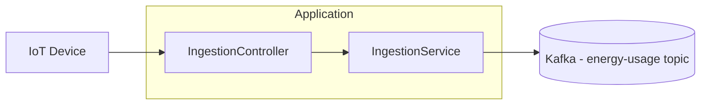
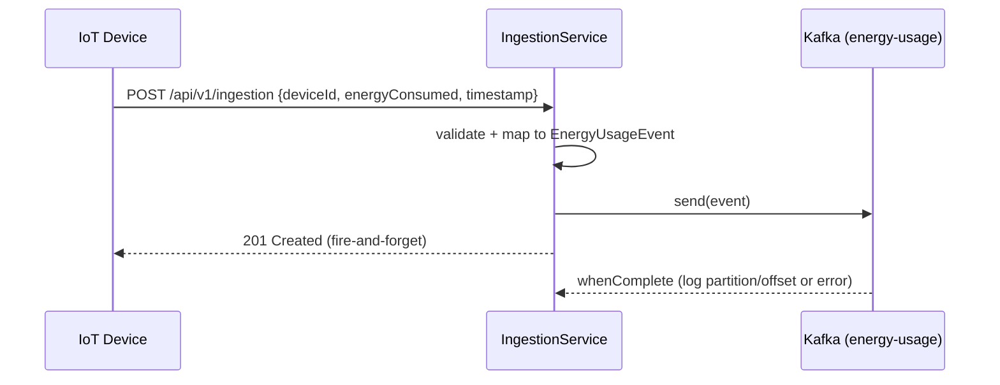

# ⚡ Ingestion Service

  

> Java Spring Boot microservice that ingests energy usage readings from IoT devices for the **Energy Tracker** home energy tracking platform.

The **Ingestion Service** exposes a single REST endpoint that receives energy usage readings from IoT devices and publishes them to **Apache Kafka** for downstream processing by other services (Usage, Insight, Alert). By design it is intentionally thin: it does **not** persist data, does **not** process readings, and does **not** know who consumes the events. It only validates, converts each reading into a domain event and hands it off asynchronously to the `energy-usage` topic.

---

## 📑 Table of Contents

- [Architecture](#-architecture)
- [Tech Stack](#-tech-stack)
- [API Endpoints](#-api-endpoints)
- [Request / Response Examples](#-request--response-examples)
- [Data Model](#-data-model)
- [Getting Started](#-getting-started)
- [Configuration](#-configuration)
- [Testing](#-testing)
- [Async Publishing Strategy](#-async-publishing-strategy)
- [Data Simulation](#-data-simulation)
- [Error Handling](#-error-handling)
- [Project Structure](#-project-structure)
- [Roadmap](#-roadmap)

---

## 🏗️ Architecture

The service follows a **thin layered architecture**: `Controller → Service → Kafka`. DTOs are used as the API contract and the Service maps them to domain events published via Spring for Apache Kafka (`KafkaTemplate`). There is no database and no repository layer: the only output of the service is a message pushed to Kafka.



Publishing is **fire-and-forget**: `send` returns immediately once the message is handed off to Kafka and the completion callback only logs the outcome. Downstream consumption is fully decoupled and asynchronous.

---

## 🧰 Tech Stack

| Technology          | Version    | Purpose                                   |
| ------------------- | ---------- | ----------------------------------------- |
| Java                | 21         | Language / runtime                        |
| Spring Boot         | 4.1.1      | Application framework                     |
| Spring WebMVC       | (SB)       | REST controller                          |
| Spring for Kafka    | (SB)       | Kafka producer (`KafkaTemplate`)         |
| Apache Kafka        | KRaft      | Message broker (local infra via docker)   |
| jackson-datatype-jsr310 | —       | `Instant` / time API serialization        |
| SpringDoc OpenAPI   | 3.1.1      | Swagger UI / API documentation            |
| Lombok              | 1.18.36    | Boilerplate reduction                     |
| Maven               | —          | Build tool                                |
| Docker              | —          | Local infra via `docker-compose`          |
| Actuator + Prometheus| —          | Health / metrics endpoint                 |
| JUnit 5 / Mockito / AssertJ | —  | Testing                                   |

---

## 🔗 API Endpoints

The single endpoint is under the base path `/api/v1/ingestion`.

> Interactive docs available at [Swagger UI](http://localhost:8082/swagger-ui.html) (OpenAPI spec at [`/v3/api-docs`](http://localhost:8082/v3/api-docs)).

| Method | Path               | Description                                  | Status codes              |
| ------ | ------------------ | -------------------------------------------- | ------------------------- |
| POST   | `/`                | Ingest a single energy usage reading         | `201`, `400`, `500`       |

`POST /api/v1/ingestion` accepts a JSON body with `deviceId`, `energyConsumed` and `timestamp` (see [Data Model](#-data-model)). It validates the payload and returns `201 Created` as soon as the message is queued to Kafka.

---

## 📦 Request / Response Examples

### Ingest a reading

```http
POST /api/v1/ingestion
Content-Type: application/json
```

```json
{
  "deviceId": 42,
  "energyConsumed": 3.5,
  "timestamp": "2026-10-04T15:30:45Z"
}
```

**Response `201 Created`** — empty body, the reading was validated and queued.

**Response `400 Bad Request`** — validation failed:

```json
{
  "status": 400,
  "error": "Bad Request",
  "message": "deviceId: deviceId must not be null"
}
```

Other validation examples (`message` field):

| Failed field              | Message                                   |
| ------------------------- | ----------------------------------------- |
| `energyConsumed` (negative) | `energyConsumed must be zero or positive` |
| `timestamp` (missing)      | `timestamp must not be null`             |
| `timestamp` (future)       | `timestamp must not be in the future`    |
| malformed JSON             | `Malformed request body`                 |

---

## 🗂️ Data Model

The service carries no persistence model. The API contract is the `EnergyUsageDto` record, which the service maps to an `EnergyUsageEvent` before publishing. Both share the same shape:

| Field            | Type     | Validation                                   | Notes                             |
| ---------------- | -------- | -------------------------------------------- | --------------------------------- |
| `deviceId`       | Long     | `@NotNull`                                  | Id of the reporting device        |
| `energyConsumed` | double   | `@PositiveOrZero` (kWh)                    | Energy since the last reading     |
| `timestamp`      | Instant  | `@NotNull`, `@PastOrPresent`, ISO-8601     | Serialized as JSON string        |

The event is published to the `energy-usage` topic; the consumer contract is defined by `com.pgs.kafka.event.EnergyUsageEvent`.

---

## 🚀 Getting Started

### Prerequisites

- **Java 21** (JDK)
- **Maven** 3.9+
- **Docker** (with Docker Compose) for Kafka

### Running locally

1. Start the infrastructure (Kafka in KRaft mode + Kafka UI) with Docker Compose:

   ```bash
   docker compose up -d kafka kafka-ui
   ```

2. Run the application:

   ```bash
   mvn spring-boot:run
   ```

3. The service will be available at `http://localhost:8082` and Swagger UI at `http://localhost:8082/swagger-ui.html`. Kafka UI is available at `http://localhost:8070`.

---

## ⚙️ Configuration

Configuration lives in `src/main/resources/application.properties`. Sensitive and environment-specific values can be overridden via environment variables.

| Property / Env var                             | Default value                                    | Description                     |
| ---------------------------------------------- | ------------------------------------------------ | ------------------------------- |
| `SERVER_PORT` / `server.port`                  | `8082`                                           | HTTP port of the service        |
| `spring.kafka.bootstrap-servers`               | `localhost:9094`                                 | Kafka broker address            |
| `spring.kafka.template.default-topic`         | `energy-usage`                                   | Default producer topic         |
| `spring.kafka.producer.key-serializer`        | `StringSerializer`                               | Key serializer (Kafka)         |
| `spring.kafka.producer.value-serializer`      | `JsonSerializer`                                 | Value serializer (Kafka)       |
| `simulation.endpoint`                         | `http://localhost:8082/api/v1/ingestion`         | Endpoint hit by simulators      |
| `simulation.requests-per-interval`            | `10000`                                          | Requests sent per interval      |
| `simulation.interval-ms`                      | `60000`                                          | Interval (ms) between batches   |
| `simulation.parallel-threads`                 | `10`                                             | Threads used by the parallel simulator |
| `management.endpoints.web.exposure.include`   | `health,info,prometheus`                        | Actuator endpoints exposed      |

The application runs with the `default` (dev) profile and exposes health/info/Prometheus metrics via Spring Actuator.

---

## 🧪 Testing

The project follows a layered testing strategy. No real Kafka broker is required — `KafkaTemplate` is mocked in the unit tests and `@WebMvcTest` slices the web layer, so the tests stay fast and self-contained.

| Test class                          | Type                     | Scope                                        |
| ----------------------------------- | ------------------------ | -------------------------------------------- |
| `IngestionServiceTest`              | Unit (Mockito)           | DTO→event mapping + Kafka publish callback   |
| `IngestionControllerTest`           | Web slice               | `@WebMvcTest` + MockMvc (201 + validation)   |
| `GlobalExceptionHandlerTest`        | Web slice               | `@WebMvcTest` + MockMvc (error mapping)      |
| `IngestionServiceApplicationTests`  | Context load             | Bootstraps the context                       |

Run all tests:

```bash
mvn test
```

Run only the fast unit tests (service logic, no Spring context):

```bash
mvn test -Dtest=IngestionServiceTest
```

Run the web slice tests:

```bash
mvn test -Dtest=IngestionControllerTest,GlobalExceptionHandlerTest
```

---
## ⚡ Async Publishing Strategy

The service is intentionally thin and decoupled. Each incoming reading is converted into an `EnergyUsageEvent` and pushed to the `energy-usage` topic through `KafkaTemplate.send`. The call returns immediately (fire-and-forget) and the `whenComplete` callback only logs either the published partition/offset or a failure — it never propagates errors to the caller.



Because the producer is fire-and-forget, ingestion latency is minimal and is decoupled from the processing that downstream consumers (Usage, Insight, Alert) perform asynchronously.

---

## 📊 Data Simulation

The service ships two optional load generators that POST synthetic readings to the ingestion endpoint to exercise the pipeline under load:

| Component                  | Type                    | Behaviour                                  |
| -------------------------- | ----------------------- | ------------------------------------------ |
| `ContinuousDataSimulator`  | `CommandLineRunner`     | Sequentially sends `requests-per-interval` readings |
| `ParallelDataSimulator`    | `CommandLineRunner`     | Splits the batch across `parallel-threads` workers |

Both generate random `deviceId` values, `energyConsumed` values between `0.00` and `2.00` kWh, and a current timestamp. The `@Scheduled` trigger is currently commented out, so they are ready to be enabled for load testing.

---

## 🛑 Error Handling

Errors are centralized in `GlobalExceptionHandler` (`@RestControllerAdvice`). All error responses share a common `ErrorResponse` body: `{ "status": ..., "error": ..., "message": ... }`.

| Exception                                  | HTTP status | Reason                          |
| ------------------------------------------ | ----------- | ------------------------------- |
| `MethodArgumentNotValidException`         | `400`       | Bean validation (`@Valid`) failed |
| `IllegalArgumentException`                | `400`       | Invalid argument               |
| `HttpMessageNotReadableException`         | `400`       | Malformed / unreadable body    |
| `Exception` (generic fallback)            | `500`       | Unexpected error                |

**Example error body (`400`, validation):**

```json
{
  "status": 400,
  "error": "Bad Request",
  "message": "deviceId: deviceId must not be null"
}
```

---

## 📁 Project Structure

```
ingestion-service
├── pom.xml
├── src
│   ├── main
│   │   ├── java/com/pgs
│   │   │   ├── ingestion/service
│   │   │   │   ├── IngestionServiceApplication.java
│   │   │   │   ├── config
│   │   │   │   │   └── OpenApiConfig.java
│   │   │   │   ├── controller
│   │   │   │   │   └── IngestionController.java
│   │   │   │   ├── dto
│   │   │   │   │   ├── EnergyUsageDto.java
│   │   │   │   │   └── ErrorResponse.java
│   │   │   │   ├── exception
│   │   │   │   │   └── GlobalExceptionHandler.java
│   │   │   │   ├── service
│   │   │   │   │   └── IngestionService.java
│   │   │   │   └── simulation
│   │   │   │       ├── ContinuousDataSimulator.java
│   │   │   │       └── ParallelDataSimulator.java
│   │   │   └── kafka/event
│   │   │       └── EnergyUsageEvent.java
│   │   └── resources
│   │       └── application.properties
│   └── test
│       └── java/com/pgs/ingestion/service
│           ├── IngestionServiceApplicationTests.java
│           ├── controller
│           │   └── IngestionControllerTest.java
│           ├── exception
│           │   └── GlobalExceptionHandlerTest.java
│           └── service
│               └── IngestionServiceTest.java
```

---

## 🗺️ Roadmap

- [ ] Enable the `@Scheduled` trigger to run the data simulators automatically.
- [ ] Add a sync/acknowledgement endpoint or durable outbox to avoid losing messages if Kafka is down.
- [ ] Add OpenAPI error schema polish and response examples for all endpoints.
- [ ] Add Kafka health-check and producer failure metrics (e.g. Prometheus counters).
- [ ] Add graceful fallback / retry with backoff when the broker is temporarily unavailable.
- [ ] Add an E2E test with a real Kafka broker via Testcontainers.
