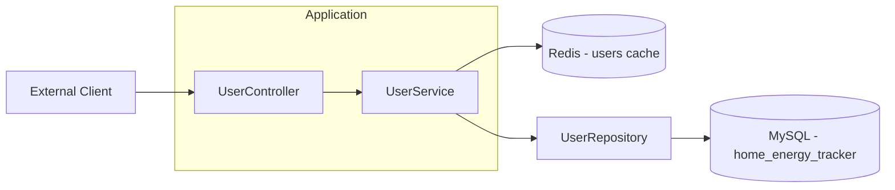
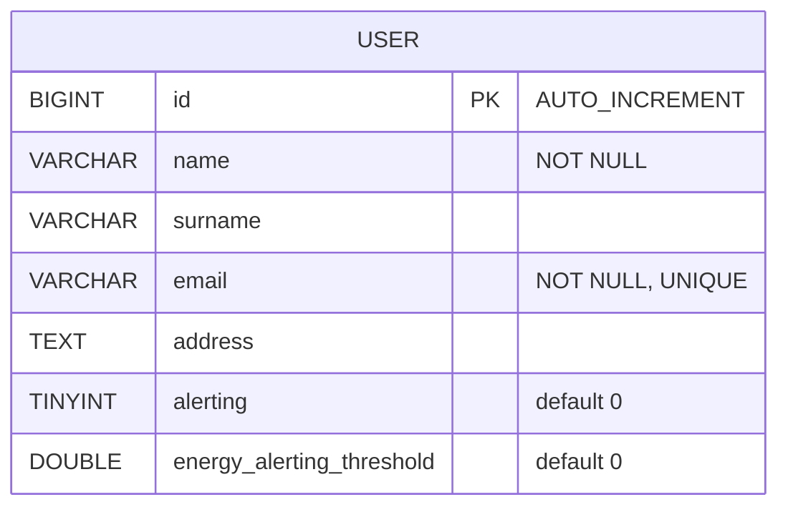
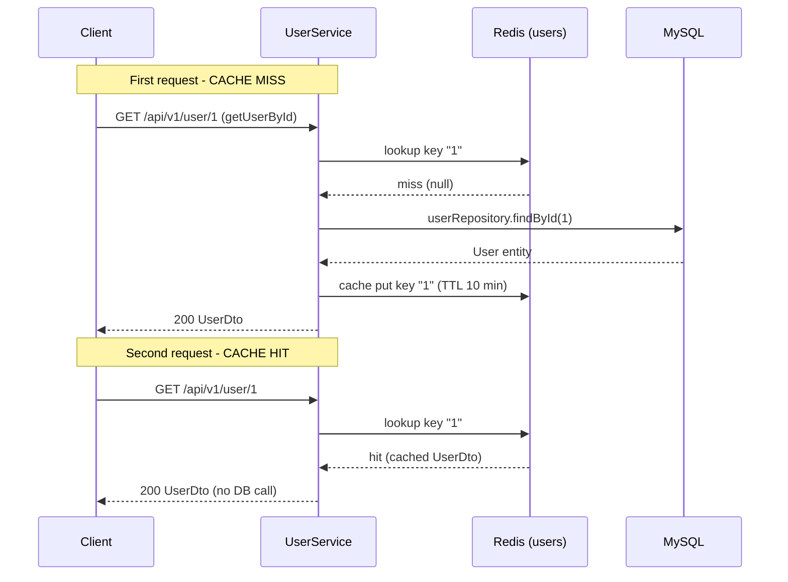

# ⚡ User Service

  

> Java Spring Boot microservice that manages the users of the **Energy Tracker** home energy tracking platform.

The **User Service** provides a REST API to Create, Read, Update and Delete users, along with dynamic filtering and pagination. It is designed as a self-contained, testable microservice: it uses JPA/Hibernate with MySQL for persistence, Redis as a caching layer to speed up read operations, and Flyway to version the database schema.

---

## 📑 Table of Contents

- [Architecture](#-architecture)
- [Tech Stack](#-tech-stack)
- [API Endpoints](#-api-endpoints)
- [Request / Response Examples](#-request--response-examples)
- [Data Model](#-data-model)
- [Getting Started](#-getting-started)
- [Configuration](#-configuration)
- [Testing](#-testing)
- [Caching Strategy](#-caching-strategy)
- [Error Handling](#-error-handling)
- [Project Structure](#-project-structure)
- [Roadmap](#-roadmap)

---

## 🏗️ Architecture

The service follows a classic **layered architecture**: `Controller → Service → Repository → Database`. DTOs are used as the API contract, entities for persistence, and Specifications for dynamic filtering. The Service layer reads from a Redis cache (via Spring Cache) before hitting the database.



Cache interactions between the Service and Redis use Spring Cache — `@Cacheable` / `@CacheEvict` on the `users` cache.

---

## 🧰 Tech Stack

| Technology          | Version    | Purpose                                   |
| ------------------- | ---------- | ----------------------------------------- |
| Java                | 21         | Language / runtime                        |
| Spring Boot         | 4.1.1      | Application framework                     |
| Spring WebMVC       | (SB)       | REST controllers                          |
| Spring Data JPA     | (SB)       | Persistence / repositories                |
| Hibernate           | (SB)       | ORM implementation                        |
| MySQL               | 8          | Production database                       |
| H2                  | 2.4.240    | Embedded DB for JPA slice tests           |
| Redis               | —          | Cache layer (`users` cache)               |
| Flyway              | (SB)       | Database migrations                       |
| SpringDoc OpenAPI   | 3.1.1      | Swagger UI / API documentation            |
| Lombok              | 1.18.36    | Boilerplate reduction                     |
| Maven               | —          | Build tool                                |
| Docker              | —          | Local infra via `docker-compose`          |
| Testcontainers      | 1.21.3     | Real MySQL + Redis in E2E tests           |
| JUnit 5 / Mockito / AssertJ | —  | Testing                                   |

---

## 🔗 API Endpoints

All endpoints are under the base path `/api/v1/user`.

> Interactive docs available at [Swagger UI](http://localhost:8080/swagger-ui.html) (OpenAPI spec at [`/v3/api-docs`](http://localhost:8080/v3/api-docs), group `users`).

| Method | Path         | Description                                          | Status codes             |
| ------ | ------------ | ---------------------------------------------------- | ------------------------ |
| POST   | `/`          | Create a user                                        | `201`, `400`, `409`, `500` |
| GET    | `/`          | List all users (no pagination)                       | `200`, `500`             |
| GET    | `/page`      | Paginated list of users                              | `200`, `400`, `500`      |
| GET    | `/search`    | Search users with optional filters + pagination      | `200`, `400`, `500`      |
| GET    | `/{id}`      | Get a user by id (cacheable)                         | `200`, `404`, `500`      |
| PUT    | `/{id}`      | Update an existing user                              | `200`, `400`, `404`, `500` |
| DELETE | `/{id}`      | Delete a user by id                                  | `204`, `404`, `500`      |

`GET /search` accepts the following optional query params: `name`, `surname`, `email`, `address` (case-insensitive fragments), `alerting` (boolean), `minEnergyAlertingThreshold` (number), plus pagination `page` (default `0`) and `size` (default `10`).

---

## 📦 Request / Response Examples

### Create a user

```http
POST /api/v1/user
Content-Type: application/json
```

```json
{
  "name": "Ana",
  "surname": "García",
  "email": "ana.garcia@example.com",
  "address": "Calle Mayor 5, Madrid",
  "alerting": true,
  "energyAlertingThreshold": 3200.5
}
```

**Response `201 Created`** — the `id` is auto-generated:

```json
{
  "id": 1,
  "name": "Ana",
  "surname": "García",
  "email": "ana.garcia@example.com",
  "address": "Calle Mayor 5, Madrid",
  "alerting": true,
  "energyAlertingThreshold": 3200.5
}
```
**Response `409 Conflict`** (email already exists):

```json
{
  "status": 409,
  "error": "Conflict",
  "message": "User already exists with email: ana.garcia@example.com"
}
```

### Get a user by id

```http
GET /api/v1/user/1
```

**Response `200 OK`**

```json
{
  "id": 1,
  "name": "Ana",
  "surname": "García",
  "email": "ana.garcia@example.com",
  "address": "Calle Mayor 5, Madrid",
  "alerting": true,
  "energyAlertingThreshold": 3200.5
}
```

**Response `404 Not Found`**

```json
{
  "status": 404,
  "error": "Not Found",
  "message": "User not found with id: 99"
}
```

### Update a user

```http
PUT /api/v1/user/1
Content-Type: application/json
```

```json
{
  "name": "Ana María",
  "surname": "García López",
  "email": "ana.garcia@example.com",
  "address": "Av. de la Energía 22, Madrid",
  "alerting": false,
  "energyAlertingThreshold": 2500.0
}
```

**Response `200 OK`**

```json
{
  "id": 1,
  "name": "Ana María",
  "surname": "García López",
  "email": "ana.garcia@example.com",
  "address": "Av. de la Energía 22, Madrid",
  "alerting": false,
  "energyAlertingThreshold": 2500.0
}
```

### Delete a user

```http
DELETE /api/v1/user/1
```

**Response `204 No Content`** (empty body).

### Search users (paginated, filtered)

```http
GET /api/v1/user/search?name=ana&alerting=true&minEnergyAlertingThreshold=1000&page=0&size=10
```

**Response `200 OK`** — the `PageResponse` wrapper:

```json
{
  "content": [
    {
      "id": 1,
      "name": "Ana",
      "surname": "García",
      "email": "ana.garcia@example.com",
      "address": "Calle Mayor 5, Madrid",
      "alerting": true,
      "energyAlertingThreshold": 3200.5
    }
  ],
  "page": 0,
  "size": 10,
  "totalElements": 1,
  "totalPages": 1,
  "last": true,
  "first": true,
  "empty": false
}
```

### List all users

```http
GET /api/v1/user
```

**Response `200 OK`** — an array of `UserDto` objects.

---

## 🗂️ Data Model

The persistence model is intentionally simple: a single `User` entity mapped to the `user` table.



| Field                     | Type   | Constraints              | Notes                            |
| ------------------------- | ------ | ------------------------ | -------------------------------- |
| `id`                      | Long   | PK, auto-generated       | `IDENTITY` strategy              |
| `name`                    | String | NOT NULL                 |                                  |
| `surname`                 | String | —                        |                                  |
| `email`                   | String | NOT NULL, UNIQUE         | Uniqueness enforced by `uk_user_email` and checked on create |
| `address`                 | String | —                        | `TEXT` column                    |
| `alerting`                | boolean| default `0`              |                                  |
| `energyAlertingThreshold` | double | default `0`              | Column `energy_alerting_threshold` |

The schema is created and versioned by the Flyway migration `V1__user_table.sql`; `spring.jpa.hibernate.ddl-auto` is set to `none`.
---

## 🚀 Getting Started

### Prerequisites

- **Java 21** (JDK)
- **Maven** 3.9+
- **Docker** (with Docker Compose) for MySQL and Redis

### Running locally

1. Start the infrastructure (MySQL + Redis) with Docker Compose:

   ```bash
   docker compose up -d
   ```

2. Run the application:

   ```bash
   mvn spring-boot:run
   ```

3. The service will be available at `http://localhost:8080` and Swagger UI at `http://localhost:8080/swagger-ui.html`.

---

## ⚙️ Configuration

Configuration lives in `src/main/resources/application.properties`. Sensitive and environment-specific values can be overridden via environment variables.

| Property / Env var                         | Default value                                   | Description                     |
| ------------------------------------------ | ----------------------------------------------- | ------------------------------- |
| `SERVER_PORT` / `service.port`             | `8080`                                          | HTTP port of the service        |
| `SPRING_DATASOURCE_URL`                    | `jdbc:mysql://localhost:3306/home_energy_tracker` | MySQL JDBC URL                  |
| `SPRING_DATASOURCE_USERNAME`               | `root`                                          | Database user                   |
| `SPRING_DATASOURCE_PASSWORD`               | `admin`                                         | Database password               |
| `SPRING_DATA_REDIS_HOST`                   | `localhost`                                     | Redis host                      |
| `SPRING_DATA_REDIS_PORT`                   | `6379`                                          | Redis port                      |
| Cache TTL (`CacheConfig`)                  | `10 minutes`                                    | TTL for entries in the `users` cache |
| `SPRINGDOC_SWAGGER_UI_PATH`                | `/swagger-ui.html`                              | Swagger UI path                 |
| `SPRINGDOC_API_DOCS_PATH`                  | `/v3/api-docs`                                  | OpenAPI spec path               |
| `logging.level.org.springframework.cache`  | `TRACE`                                         | Cache logging level (dev)       |

The application runs with the `default` (dev) profile. An additional `test` profile is used by the slice tests (H2 in MySQL mode).

---

## 🧪 Testing

The project follows a layered testing strategy: fast unit tests, Spring slice tests (web / JPA / cache), and a full E2E test with real MySQL and Redis via Testcontainers.

| Test class                          | Type                     | Scope                                        |
| ----------------------------------- | ------------------------ | -------------------------------------------- |
| `UserServiceTest`                   | Unit (Mockito)           | Service logic, no Spring context             |
| `UserServiceCacheTest`              | Cache (Spring)           | `@EnableCaching` + in-memory cache manager   |
| `UserControllerTest`                | Web slice               | `@WebMvcTest` + MockMvc                      |
| `GlobalExceptionHandlerTest`        | Web slice               | `@WebMvcTest` + MockMvc (error mapping)      |
| `UserSpecificationTest`             | JPA slice               | `@DataJpaTest` + H2 (MySQL mode)             |
| `UserServiceApplicationTests`       | Context load             | Bootstraps the context                       |
| `UserServiceIntegrationTest`        | E2E (Testcontainers)    | Real MySQL + Redis + full application        |

Run all tests:

```bash
mvn test
```

Run only the fast unit tests (service logic, no Spring / infra):

```bash
mvn test -Dtest=UserServiceTest
```

Run the slice tests (web, JPA + H2, cache):

```bash
mvn test -Dtest=UserControllerTest,GlobalExceptionHandlerTest,UserSpecificationTest,UserServiceCacheTest
```

Run the E2E test (requires Docker to spin up real MySQL and Redis containers):

```bash
mvn test -Dtest=UserServiceIntegrationTest
```
---

## 💾 Caching Strategy

Reads are cached using Spring Cache with Redis as the backing store. The cache is named `users` and keyed by user `id`, with a default TTL of **10 minutes**.

- `getUserById` is annotated with `@Cacheable(value = "users", key = "#id")` — on a cache hit the DB is not queried.
- `updateUser` and `deleteUser` are annotated with `@CacheEvict(value = "users", key = "#id")` so stale entries are invalidated on writes.
- Values are serialized with a JSON serializer and **default typing restricted to the `com.pgs.user.service` package** via a `PolymorphicTypeValidator` to prevent unsafe deserialization.



---

## 🛑 Error Handling

Errors are centralized in `GlobalExceptionHandler` (`@RestControllerAdvice`). All error responses share a common `ErrorResponse` body: `{ "status": ..., "error": ..., "message": ... }`.

| Exception                                  | HTTP status | Reason                  |
| ------------------------------------------ | ----------- | ----------------------- |
| `UserNotFoundException`                    | `404`       | User id does not exist  |
| `UserAlreadyExistsException`               | `409`       | Email already in use    |
| `MethodArgumentNotValidException`          | `400`       | Validation failed       |
| `Exception` (generic fallback)             | `500`       | Unexpected error        |

**Example error body (`404`):**

```json
{
  "status": 404,
  "error": "Not Found",
  "message": "User not found with id: 99"
}
```

**Example error body (`400`, validation):**

```json
{
  "status": 400,
  "error": "Bad Request",
  "message": "name: must not be blank"
}
```

---

## 📁 Project Structure

```
user-service
├── pom.xml
├── docker-compose.yml
├── src
│   ├── main
│   │   ├── java/com/pgs/user/service
│   │   │   ├── UserServiceApplication.java
│   │   │   ├── aspect
│   │   │   │   ├── ExecutionTimeAspect.java
│   │   │   │   └── LoggingAspect.java
│   │   │   ├── config
│   │   │   │   ├── CacheConfig.java
│   │   │   │   └── OpenApiConfig.java
│   │   │   ├── controller
│   │   │   │   └── UserController.java
│   │   │   ├── dto
│   │   │   │   ├── ErrorResponse.java
│   │   │   │   ├── PageResponse.java
│   │   │   │   ├── UserDto.java
│   │   │   │   └── UserFilterDto.java
│   │   │   ├── entity
│   │   │   │   └── User.java
│   │   │   ├── exception
│   │   │   │   ├── GlobalExceptionHandler.java
│   │   │   │   ├── UserAlreadyExistsException.java
│   │   │   │   └── UserNotFoundException.java
│   │   │   ├── repository
│   │   │   │   ├── UserRepository.java
│   │   │   │   └── UserSpecification.java
│   │   │   └── service
│   │   │       └── UserService.java
│   │   └── resources
│   │       ├── application.properties
│   │       ├── META-INF/additional-spring-configuration-metadata.json
│   │       └── db/migration/V1__user_table.sql
│   └── test
│       └── java/com/pgs/user/service
│           ├── controller
│           │   └── UserControllerTest.java
│           ├── exception
│           │   └── GlobalExceptionHandlerTest.java
│           ├── integration
│           │   └── UserServiceIntegrationTest.java
│           ├── repository
│           │   └── UserSpecificationTest.java
│           └── service
│               ├── UserServiceCacheTest.java
│               └── UserServiceTest.java
```

---

## 🗺️ Roadmap

- [ ] Add request/response audit logging for mutations.
- [ ] Introduce soft-delete (`deleted_at`) instead of hard DELETE.
- [ ] Add OpenAPI error schema polish and response examples for all endpoints.
- [ ] Add a search endpoint with sorting and a `like`/`eq` operator map.
- [ ] Add graceful fallback to DB when Redis is temporarily unavailable.